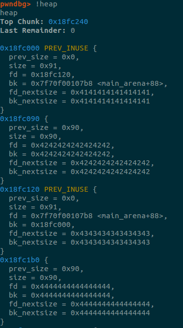
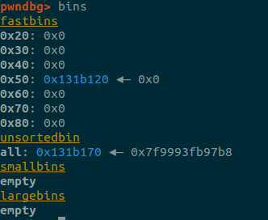
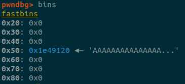
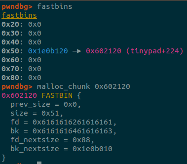
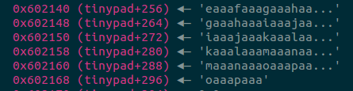
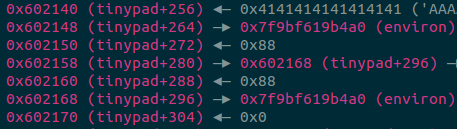
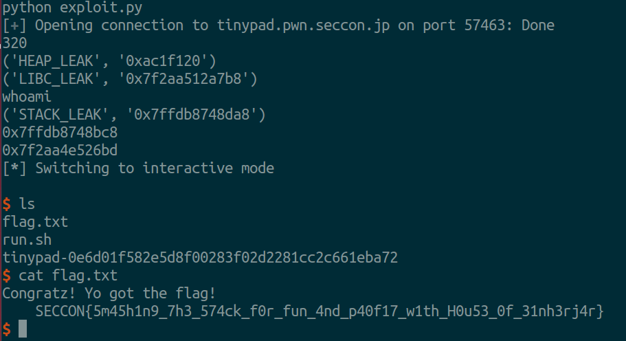

# Tinypad - Pwn 300 Problem (SECCON QUALS 2016)

## Description
**Difficulty**: medium medium to medium hard  
**Host** : tinypad.pwn.seccon.jp  
**Port** : 57463  

Heap Fun as a Service!

## Overview
Tinypad is an x86-64 ELF (NX, FULL RELRO, no PIE) implementing you guessed it a note taking service. The service supports storing up to four notes of max length 256 chars.

The user can add, modify, and free notes after adding them.

## Reversing
The **tinypad** global array of size 320 has 256 bytes allocated for swap space which is used when editing notes. The last 64 bytes are used to store the size of the note and pointer into the heap of the note. I will refer to these as the **_size_** and **_addr_** indexes of tinypad and I will refer to the first 256 bytes as the **_temp space_** of tinypad.


When a note is printed, the addr index of **tinypad**

```c
//print notes
notes = &tinypad[256];
for (i = 0; i < 4; ++i) {
    addr = notes[(i * 16) + 8]; //addr
    if (addr) {
        puts(addr);
    }
}
```

When a note is to be added, the size index of the **tinypad** array is checked. If it is set the next index is used, if not move on to the next.
```c
//add note
notes = &tinypad[256];
for (i = 0; i < 4; ++i) {
    size = notes[i * 16]; //size
    if (!size) {
        char 
        new_size = read_int(); //Just reads an integer from stdin
        char *note = malloc(new_size);

        notes[i * 16] = new_size;
        notes[(i * 16) + 8] = note;

        read_until(note, new_size, '\n');
    }
}
```

When a note is to be edited, the size index is checked to make sure a note exists. If the size is full, `strcpy` what is already in the note into the **_temp space_** of **tinypad**, takes the string length of that and uses **read_until** to read in input over the **_temp_space_** then copies the **_temp space_** back into the note. So you can't edit more characters in the note than it already has, this is important for later.
```c
//edit note
temp  = tinypad;
notes = &tinypad[256];
size  = notes[i * 16]; //size
note  = notes[(i * 16) + 8];
if (size) {
    strcpy(temp, note);
    size_t len = strlen(temp);
    read_until(temp, len, '\n');
    strcpy(note, temp);
}
```

When a note is deleted
```c
//delete note
notes = &tinypad[256];
size  = notes[i * 16];
note  = notes[(i * 16) + 8];
if (size) {
    free(note);
    note[i * 16] = 0;
}
//never nulls out the addr of the note
```

The **read_until** function reads in data from the user until a character is met.
```c
int readuntil(char *a, size_t length, char delim) {
    for (i = 0; i < length; ++i) {
        int r = read(0, &a[i], 1);
        if (!r || a[i] == delim)
            break;
    }
    // i can now equal 256
    a[i] = 0;
    return i;
}

//Example call
read_until(buf, 256, '\n');
```

## Bugs
Use After Free: Note pointers are not removed from the global array after being freed.  
Null byte off by one in **read_until** function. Allowing off by one when adding and editing notes.  

Ideas:
- **[Fail]** Edit using 256 bytes and zero out the *size* field of the first note in the **tinypad** array.
- **[Fail]** unsafe unlink


## Exploit

### Setup (to be used later)
Create a free chunk in the temp space of the **tinypad** array above our pointers.

### Easy Memory Leaks
Triggering a use after free is trivial. Just create a note and delete it. This use after free can only be used for printing notes so it just gets us a few useful leaks.

To get a libc leak we can take advantage of the fact that freed chunks in **smallbins** can point to the head or tail of that freelist which exists in libc.

To take advantage of this we  
1. Create 4 notes, all in smallbin size range  
2. Delete the third note  
3. Delete the first note  
4. Read the output from the main screen  

Now the `fd` pointer of the third note points to the freelist, and the `fd` pointer of the first note points to the third note. Luckily the `fd` pointer is in the same space data would be for a malloc chunk, so this part is printed out.



The next print will print these out and we have the address of our heap and libc, which we can use to caluclate libc's base. 

Now I just deleted every not to start with a fresh heap.

### Playing with the heap

Next we take advantage of our [one byte null overwrite](https://github.com/shellphish/how2heap/blob/master/poison_null_byte.c).  
The idea is explained there, but to summarize the technique  
1. `A = malloc(0x88)`  - Allocate chunk of size smallbin  
2. `B = malloc(0x100)` - Allocate chunk double the size of `A`  
3. `C = malloc(0x80)`  - Allocate chunk of any size  
4. `free(B)`   
5. `chunk(B).size & ~0x11` - overflow `A` into `B`, clearing prev_inuse and making the size smaller (I'm just clearing the bottom two bites of chunk size here for representation)  
6. `b1 = malloc(0x80)` - This will be allocated where `B` was allocated  
7. `b2 = malloc(0x40)` - This will be allocated at the address of `C` subtracted with the `size(b1)`  
8. `free(b1)`  
9. `free(C)` - This will consolidate to `addr(B)` giving `B` a new size of `0x1a0`  
10. `D = malloc(0x190)` - Allocate chunk that fits into the consolidated  
11. At this point we can fill up `D` which overlaps with `b2`, giving a normal heap overflow.

We used this technique with those sizes, but before allocating room for `D` we freed `b2`. `b2` is in the fastbin range so it was placed in the fastbins. (add note was used to malloc, delete note was used to free, add note of length 256 for the null overwrite)  
**9a.** `free(b2)`


In this picture `b2` is is the value in the fastbin, and `C` is the value in the unsorted bin.
  

Now we allocated `D`, overflowing the freed chunk `b2` with arbitrary values.  
  

Overflow this with the address of our fake free chunk we created in the **Setup** part of this document, just above the pointers in the **tinypad** array. A few things to note here, the fake fastbin needs to have the same size as the fastbin it is in.


Now we allocate two more notes that will have the size `0x50`, causing `malloc` to return the address in **tinypad**.

The second note we add will overwrite the pointer section of the **tinypad** array holding the sizes and addresses of notes.


### What should we write over the note pointers with?
Idea:
- **Note** full relro, we can't just overwrite the `.got`
- We can get more leaks by writing more pointers over the note pointers.
- We can overwrite the note pointers with the addresses of other note pointers, so we can edit them later.

So with this we decided to overwrite the first note with the address of `environ` in libc. The `environ` pointer holds a pointer to the stack of the current elf. The second index with the address of the third index, and the third index with non null value so it can bet edited using the `edit_note` function.  

  

Now we use the value leaked from `environ` pointer to calculate the address of a return address, we chose the address `main` returns to when it is finished. Then we could edit the second note and overwrite the third note with the address pointing to the return address after main. Now when main finishes it will return to the value we just wrote.

### Ropping
Luckily for us one of libc's magic return addresses worked and we returned to that. Now after pressing **q** to quit the menu and program we get a shell.


[exploit.py](exploit.py)

### The Flag

